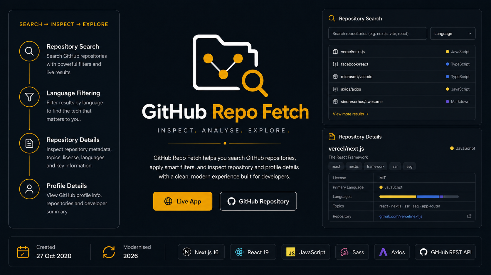

# GitHub Repo Fetch

**Search and inspect GitHub repositories through a focused Next.js interface.**

A modernised version of a 2020 Hyperion Development Bootcamp project using the GitHub REST API.

**Live:** [github-repo-fetch-2026.vercel.app](https://github-repo-fetch-2026.vercel.app)  
**Original:** [github-repo-fetch-app.vercel.app](https://github-repo-fetch-app.vercel.app)  
**Stack:** Next.js · React · JavaScript · Sass · Axios · GitHub REST API  
**Status:** v2 · Complete / Live

GitHub Repo Fetch searches repositories, filters results by language, and provides repository and profile details while preserving the original project as evidence of its starting point.

## Project Journey

2020 Project → Preserved → Restored → Understood → Modernised → Deployed 2026

The modernised version improves the interface, responsiveness, accessibility, API handling, navigation and overall user experience.

## Core Features

- GitHub repository search
- Language filtering
- Repository details
- GitHub profile details
- GitHub API integration
- Responsive interface
- Accessible navigation and controls
- Search and filter state preservation

## Technology

**Original:** Next.js, React, JavaScript, Sass, Bulma, Axios, GitHub REST API

**Modernised:** Next.js, React, JavaScript, Sass, Axios, GitHub REST API

## Background

Originally built in 2020 during the Hyperion Development Bootcamp.

Modernised in 2026 as part of a portfolio project restoration and modernisation programme.

Created by **Chameleon Unicode Studios (Pty) Ltd**.

## License

MIT
